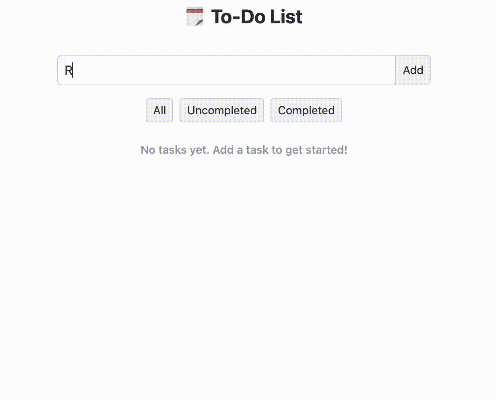

# To-Do List to Practice JavaScript

A simple application built to practice and learn core JavaScript concepts.

## Preview

  

## Try it

[Try the project here](https://to-do-list-ten-bay-47.vercel.app/)

## Concepts Practiced

- **DOM & UI**: Creating elements dynamically, updating text, and finding specific elements using `dataset` and `querySelector`.
- **Event Handling**: Managing form submissions, clicks, and inputs cleanly without messing up the global scope.
- **State Management**: Handling application states (like switching between creating and editing) and keeping data separate from the UI.
- **Local Storage**: Saving and loading data securely using `localStorage`, `JSON.parse`, and `JSON.stringify`.
- **Array Methods**: 
  - Using `forEach()` to render tasks.
  - Using `findIndex()` to locate items by ID.
  - Using `splice()` to remove items safely.
  - Using `filter()` to manage task visibility.
- **Modular Code**: Organizing the project into clean ES modules using `import` and `export`.

## Tech Used

- Vanilla JavaScript
- Vite
- Tailwind CSS (v4)
- HTML5